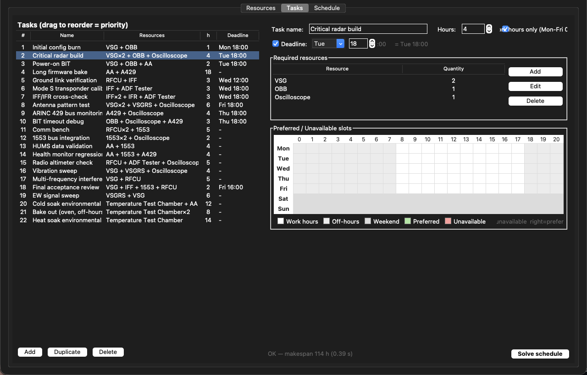
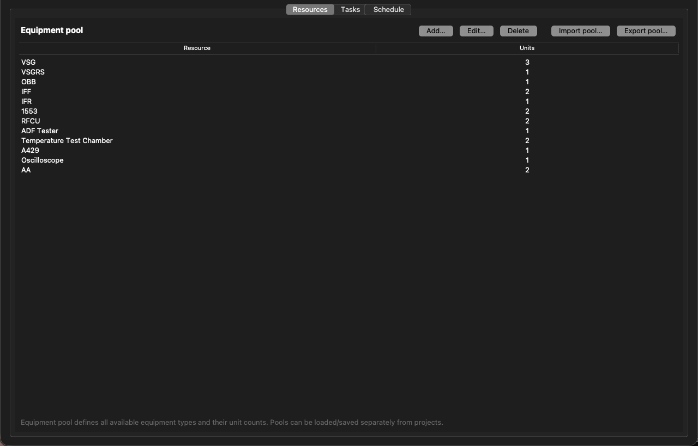

# Task-Resources Planner

[](https://github.com/Mavrikant/Task-Resources-Planner/actions/workflows/tests.yml)
[](https://codecov.io/gh/Mavrikant/Task-Resources-Planner)
[](https://www.python.org/downloads/)
[](#cross-platform)
[](LICENSE)

> **Stop hand-packing weekly lab calendars.** Drop in your equipment pool
> and a list of tasks. Let CP-SAT (Google OR-Tools) find a *provably
> optimal* one-week schedule — usually in under a second — that respects
> every deadline, work-hours rule, and preferred slot you specified.


## Why this exists

Lab managers in avionics, RF, instrumentation, environmental test, and
similar shared-equipment shops keep solving the same Tetris puzzle by
hand: a dozen tasks, each needing two or three specific testers locked
together for hours at a time, mid-week deadlines on the critical ones,
some that *must* run during work hours, others happy to bake overnight,
priorities that shift by the day. Spreadsheets and whiteboards collapse
under it. This tool turns the weekly ritual into a one-click solve.

## Highlights

- **Provably optimal** — Constraint Programming SAT (Google OR-Tools)
  searches the full space. If a feasible schedule exists, it returns
  the one with the shortest makespan; otherwise it tells you *why*.
- **Real lab constraints, first class.**
  - Multi-resource tasks: a task locks every required piece of
    equipment together for its duration (e.g. *2× VSG + 1× OBB +
    1× Oscilloscope* held simultaneously).
  - Per-unit pools: `VSG × 3` is three real units, not a string.
  - Work-hours-only flag (Mon-Fri 08-18) per task.
  - **Continue on next day** for long work-hours tasks: an 18 h
    bake spans Mon 08-18 + Tue 08-16, equipment released overnight.
  - Optional per-task **deadline** (day + hour). Hard, not advisory.
  - 7 × 24 click-and-drag slot grid for **preferred** (green) and
    **unavailable** (red) hours.
  - Drag-to-reorder priority list.
- **Cross-platform native UI** — Tk + ttk with platform themes
  (`aqua` on macOS, `vista` on Windows, `clam` on Linux), HiDPI on
  Windows, Cmd-shortcuts on macOS, and Ctrl-shortcuts elsewhere.
- **Offline and inspectable** — no server, no account, no cloud.
  Projects save as readable UTF-8 JSON for diff and version control.
- **Tested** — 46 pure-Python tests over models, solver, and
  persistence run on Linux, macOS, and Windows × Python 3.11-3.14
  on every push, with branch-coverage published to
  [Codecov](https://codecov.io/gh/Mavrikant/Task-Resources-Planner).

## Screenshots

### Tasks tab — list, editor, slot grid, and Solve button



Drag rows to reorder priority. The right pane edits the selected task:
name, hours, work-hours-only and continue-next-day flags, deadline
picker, the required-resources table, and the 7 × 24 preferred /
unavailable grid. Hit **Solve schedule** (or `Cmd/Ctrl + R`) and the
solver runs in a worker thread; the app jumps to the Schedule tab on
success.

### Resources tab — the editable equipment pool



Twelve equipment types, 19 physical units in the default pool. Add /
Edit / Delete types, or **Import pool / Export pool** to share standalone
equipment-pool JSON across projects. Renaming an equipment cascades into
every task that referenced the old name.

### Schedule tab — Gantt of the solved week


One row per *physical unit* (so `VSG-1`, `VSG-2`, `VSG-3` get their own
lanes). Tasks are colour-coded; off-hours and weekend hours are shaded.
Pan / zoom with the matplotlib toolbar. The status line at the bottom
shows status, makespan, solve time, and the number of unit-reservations.

## Quick start

```bash
git clone https://github.com/Mavrikant/Task-Resources-Planner.git
cd Task-Resources-Planner
pip install -r requirements.txt
python main.py
```

A pre-built sample is included — use **File → Open…** (or `Cmd/Ctrl + O`)
on `sample_project.json` to load 22 representative tasks (mixed work-hours,
deadlines, preferred slots, two environmental soaks, an 18-hour
continue-next-day firmware bake, and one task that dodges the Wednesday
maintenance window). On a laptop the solver returns `OPTIMAL` in well
under a second.

## How to use

1. **Resources tab.** Curate the equipment pool — Add / Edit / Delete
   types, plus Import pool / Export pool to share pools across projects.
2. **Tasks tab.**
   - **Add / Duplicate / Delete** tasks; drag rows to reorder
     (top = highest priority).
   - For the selected task, edit name, hours, the *Work hours only*
     and *Continue on next day* flags, the optional deadline, the
     required-resources table, and the 7 × 24 slot grid.
     - In the slot grid, pick a paint mode (Unavailable / Preferred /
       Clear) and click-and-drag to paint, or use right-click for
       Preferred and middle-click for Clear as power-user shortcuts.
3. **Solve schedule** — runs in a background thread. On infeasibility
   you get a diagnostic dialog (e.g. *"Task #2 needs 5 × OBB but only 1
   exists"*).
4. **Schedule tab** — read the Gantt; pan / zoom with the toolbar;
   re-run the solver any time after editing tasks.

Use **File → Save** (`Cmd/Ctrl + S`) to write the project to JSON.

### Keyboard shortcuts

| Action | macOS | Linux / Windows |
|---|---|---|
| New project | `Cmd + N` | `Ctrl + N` |
| Open project | `Cmd + O` | `Ctrl + O` |
| Save | `Cmd + S` | `Ctrl + S` |
| Save as… | `Cmd + Shift + S` | `Ctrl + Shift + S` |
| Solve schedule | `Cmd + R` | `Ctrl + R` |
| Quit | `Cmd + Q` (system) | `Ctrl + Q` |

## Optimisation objective

Lexicographic, in this order:

1. **Makespan** — the schedule is as short as possible.
2. **Preferred slots** — tasks drift toward green hours when there is
   slack.
3. **Priority** — among otherwise tied solutions, tasks higher in the
   list start earlier.

## Cross-platform

Tested on Linux, macOS, and Windows. The keyboard accelerators in
[main_window.py](lab_planner/gui/main_window.py) auto-detect the
platform and bind `Command` on macOS / `Control` elsewhere. On macOS
the Dock icon is set via PyObjC / AppKit (Tk's `iconphoto` doesn't
update the Dock for unbundled Python apps); the optional
`pyobjc-framework-Cocoa` dep is gated to `sys_platform == "darwin"` in
`requirements.txt`.

## Project layout

```
lab_planner/
  models.py            data classes + the default resource pool
  solver.py            CP-SAT formulation (contiguous + work-hours-split)
  persistence.py       JSON save/load (project + equipment pool)
  gui/
    main_window.py     App + Resources/Tasks/Schedule tabs
    task_editor.py     task detail pane + 7×24 SlotGridWidget
    gantt_view.py      matplotlib Gantt embedded in tkinter
tests/                 unit tests for models, solver, persistence
assets/                bundled icon
docs/                  screenshots used in this README
main.py                entry point
sample_project.json    22-task example project
equipment_pool.json    default 19-unit equipment pool
```

## Run tests

```bash
pytest -q
```

The 46 tests cover model validation, solver correctness (multi-unit
allocation, unit & team no-overlap, unavailable-window blocking,
preferred-window pulls, deadline enforcement, priority ordering,
work-hours-only, continue-on-next-day cross-day spanning, infeasibility
diagnostics), and JSON round-trips for both project files and
equipment-pool files.

CI — [.github/workflows/tests.yml](.github/workflows/tests.yml) — runs
the suite on `ubuntu-latest`, `windows-latest`, and `macos-latest`
across Python 3.11-3.14 (12 jobs) on every push and pull request, with
branch-coverage uploaded to Codecov.

## Tuning notes

- Default solver budget: **20 seconds** with **8 search workers**.
  Realistic instances (≤ 30 tasks) typically reach `OPTIMAL` in well
  under a second; longer-running solves return the best `FEASIBLE`
  solution found so far.
- Total weekly capacity = 19 units × 168 h = **3192 unit-hours**. If
  aggregate demand exceeds about 80 % of that, expect tighter
  schedules and longer solve times — relax unavailable hours, soften
  deadlines, or reduce task hours.

## Versioning & changelog

The project follows [Semantic Versioning](https://semver.org/).
See [CHANGELOG.md](CHANGELOG.md) for release notes.

## Contributing

Issues and PRs welcome. Keep changes scoped, run `pytest -q` before
opening, and attach a brief description of the test scenario you
exercised against `sample_project.json` if the change touches the
solver or persistence.

## Licence

[MIT](LICENSE) — © 2026 M. Serdar Karaman.
