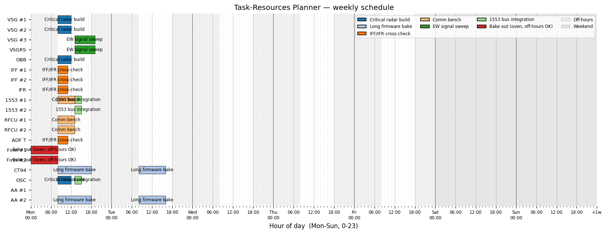

# Task-Resources Planner

[](https://github.com/Mavrikant/Task-Resources-Planner/actions/workflows/tests.yml)
[](https://codecov.io/gh/Mavrikant/Task-Resources-Planner)
[](https://www.python.org/downloads/)
[](LICENSE)

A desktop tool that builds a tight one-week schedule for shared lab
equipment. The constraint-programming engine (Google OR-Tools CP-SAT)
minimises total span, respects per-task unavailable hours and deadlines,
and prefers the slots each task marks as favourite. The result is shown
as a Gantt chart in a tkinter GUI.



## Features

- **Tasks are first-class.** Each task declares **multiple resource
  requirements at once** (e.g. *2× VSG + 1× OBB + 1× OSC*) and locks
  every required physical unit together for its duration.
- **Priority by list order.** The Tasks tab is a draggable priority
  list — the row at the top has the highest priority and is pulled
  toward earlier starts when otherwise tied with another task.
- **Deadlines.** Each task can have an optional deadline (day-of-week +
  hour-of-day); the solver hard-fails (`INFEASIBLE`) if no schedule
  meets every deadline.
- **One-week horizon** — 7 days × 24 one-hour slots = 168 slots.
- **Editable equipment pool.** Defined in `equipment_pool.json` at the
  project root and editable from the Resources tab via **Add / Edit /
  Delete** plus **Import pool / Export pool** for sharing pools across
  projects. Default pool: VSG×3, VSGRS×1, OBB×1, IFF×2, IFR×1, 1553×2,
  RFCU×2, ADF T×1, Fırın×2, CT94×1, OSC×1, AA×2 (19 physical units).
- **Per-task slot grid.** A 7×24 click-and-drag grid: left-drag to mark
  cells *unavailable* (red), right-drag to mark them *preferred*
  (green), middle-drag to clear. The grid background shades **work
  hours** (Mon-Fri 08-18), **off-hours** (light grey), and **weekends**
  (darker grey) so you can see business-time at a glance.
- **Work hours only.** A per-task hard constraint that restricts the
  task to Mon-Fri 08-18.
- **Continue on next day.** A companion flag that lets a long
  work-hours-only task pause overnight at the end of one work-day
  window and resume at the start of the next. Equipment is released
  during the overnight gap and reclaimed in the morning. Useful for
  any work that exceeds a single 10-hour window.
- **Optimisation objective** (lexicographic, in this order):
  1. **Makespan** — the schedule is as short as possible.
  2. **Preferred slots** — tasks drift toward green hours when there is slack.
  3. **Priority** — among otherwise tied solutions, tasks higher in the
     list start earlier.
- **Save / load** projects as UTF-8 JSON (schema v2).

## Requirements

- Python 3.11 or newer (tested on 3.14).
- Packages from `requirements.txt`: `ortools`, `matplotlib`, `pytest`.

## Quick start

```bash
pip install -r requirements.txt
python main.py
```

A pre-built sample is included — open **File → Open…** and pick
`sample_project.json` to see seven tasks (including a long
cross-day bake-out and several deadline-bound work-hours tasks)
already wired up. It solves to `OPTIMAL` in well under a second.

## How to use

1. **Resources tab** — view the equipment pool. Click **Add…** to
   register a new equipment type, **Edit…** to rename or change the
   unit count, **Delete** to remove a type that no task uses, or
   **Import pool… / Export pool…** to load and save standalone
   equipment-pool JSON files.
2. **Tasks tab**
   - **Add / Duplicate / Delete** for tasks; drag rows to reorder
     (top = highest priority).
   - For the selected task, edit name, hours, the *Work hours only*
     and *Continue on next day* flags, the optional deadline, the
     required-resources table (Add / Edit / Delete rows), and the
     7×24 slot grid.
   - The task list shows `# │ Name │ Resources │ h │ Deadline`.
3. **Click Solve schedule** — the solver runs in a background thread
   and switches to the Schedule tab on success. On infeasibility you
   get a diagnostic dialog (e.g. *"Task #2 needs 5× OBB but only 1
   exists"*).
4. **Schedule tab** — Gantt chart with hour-of-day labels every six
   hours, bold day separators, and shaded off-hour / weekend
   backgrounds. Pan/zoom with the matplotlib toolbar.

Use **File → Save** to write the project to JSON for later editing.

## Project layout

```
lab_planner/
  models.py            data classes + the default resource pool
  solver.py            CP-SAT formulation (contiguous + work-hours-split)
  persistence.py       JSON save/load (project + equipment pool)
  gui/
    main_window.py     App + Resources/Tasks/Schedule tabs
    task_editor.py     task detail pane + 7×24 SlotGridWidget
    gantt_view.py      matplotlib Gantt embedded in tkinter
tests/                 unit tests for models, solver, persistence
assets/                bundled icons
docs/                  screenshots used in the README
main.py                entry point
sample_project.json    example with 7 multi-resource tasks
equipment_pool.json    default 19-unit equipment pool
```

## Run tests

```bash
pytest -q
```

The 46 tests cover model validation, solver correctness (multi-unit
allocation, unit & team no-overlap, unavailable-window blocking,
preferred-window pulls, deadline enforcement, priority-ordering,
work-hours-only, continue-on-next-day cross-day spanning,
infeasibility diagnostics), and JSON round-trips for both project
files and equipment-pool files.

CI is configured at [.github/workflows/tests.yml](.github/workflows/tests.yml)
and runs the non-GUI tests on Linux + Windows × Python 3.11–3.13 on
every push and pull request.

## Tuning notes

- Default solver budget is **20 seconds** with **8 search workers**.
  Realistic instances (≤ 30 tasks) typically reach `OPTIMAL` in well
  under a second; longer-running solves return the best `FEASIBLE`
  solution found so far.
- Total weekly capacity = 19 units × 168 h = **3192 unit-hours**. If
  aggregate demand exceeds about 80 % of that, expect tighter
  schedules and longer solve times — relax unavailable hours or
  reduce task hours.

## Versioning & changelog

The project follows [Semantic Versioning](https://semver.org/).
See [CHANGELOG.md](CHANGELOG.md) for release notes.

## Licence

[MIT](LICENSE) — © 2026 M. Serdar Karaman.
